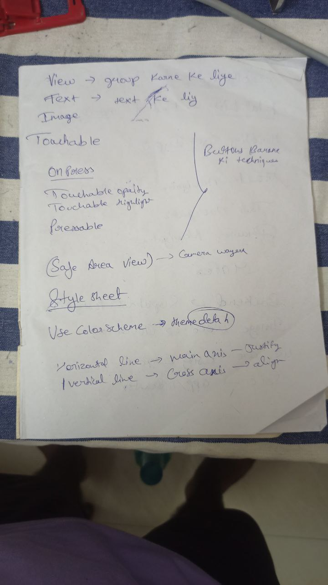
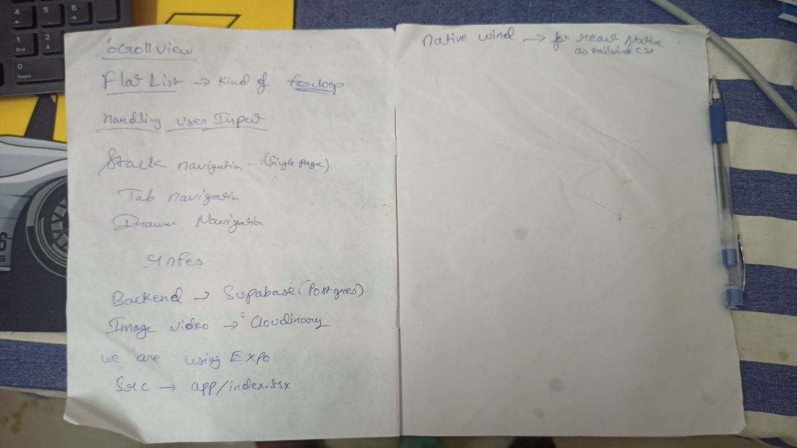

# FANON_ASSIGNMENT

We Are using Expo to build the app. Expo is a free and open-source platform for making universal native apps for Android, iOS, and the web with JavaScript and React.
https://docs.expo.dev/

## First step I did not know the react native so i learned it 

## Working Video
https://drive.google.com/file/d/1TUPj2LQcjXZV7Pde0d-JBn6JTuq7HgoY/view?usp=sharing
## Expo Installation

https://docs.expo.dev/router/installation/#manual-installation

## Icons we are using is from Expo Icons
https://icons.expo.fyi/Index

## Nativewind for styling
https://www.nativewind.dev/getting-started/expo-router

## we can use pinchable for zooming in and out
https://www.npmjs.com/package/react-native-pinchable

## Image picker from expo
https://docs.expo.dev/tutorial/image-picker/

## double tap gesture added
https://docs.expo.dev/tutorial/gestures/#add-a-tap-gesture

## eXPO vIDEO 
https://docs.expo.dev/versions/latest/sdk/video/

## Cloudinary 
https://cloudinary.com/documentation/react_native_integration

## Pixa Bay
https://pixabay.com/api/docs/
